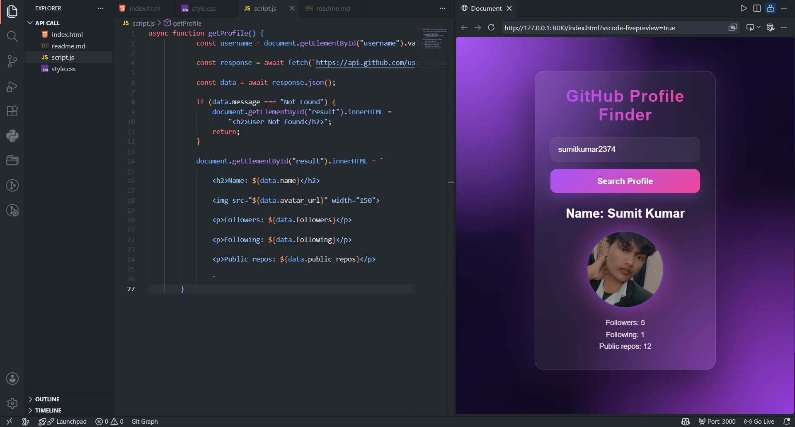

# Here is the commit list for contribution graph 

- 1st/2nd commit list
- 3rd commit list is the attaching imp files 

# 🔍 GitHub Profile Finder

A simple and responsive web application that allows users to search GitHub profiles using the GitHub REST API.

## 📸 Preview

<p align="center">
  
</p>

## ✨ Features

- Search GitHub users by username
- View profile picture and details
- Real-time data fetching with Fetch API
- Responsive and modern UI
- Error handling for invalid usernames

## 🛠️ Tech Stack

- HTML
- CSS
- JavaScript
- GitHub REST API


## 🚀 API Used

```javascript
https://api.github.com/users/{username}
```

## 👨‍💻 Author

**Sumit Kumar**

⭐ If you like this project, consider giving it a star!
